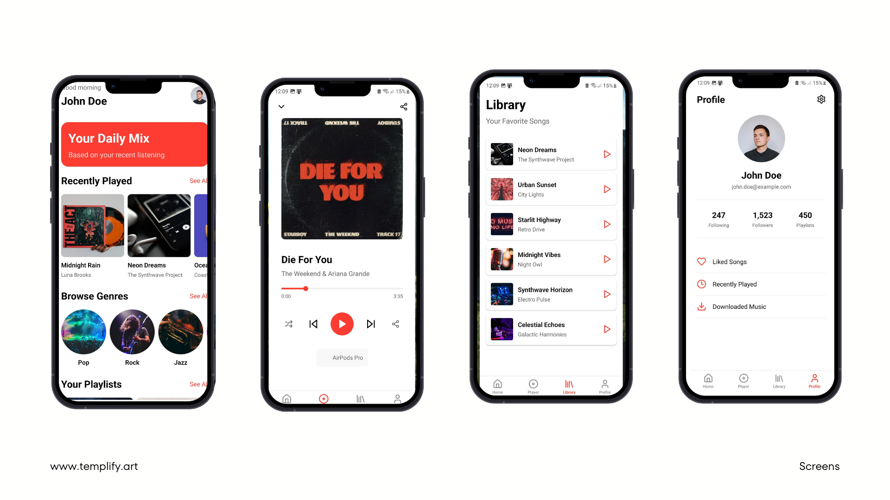
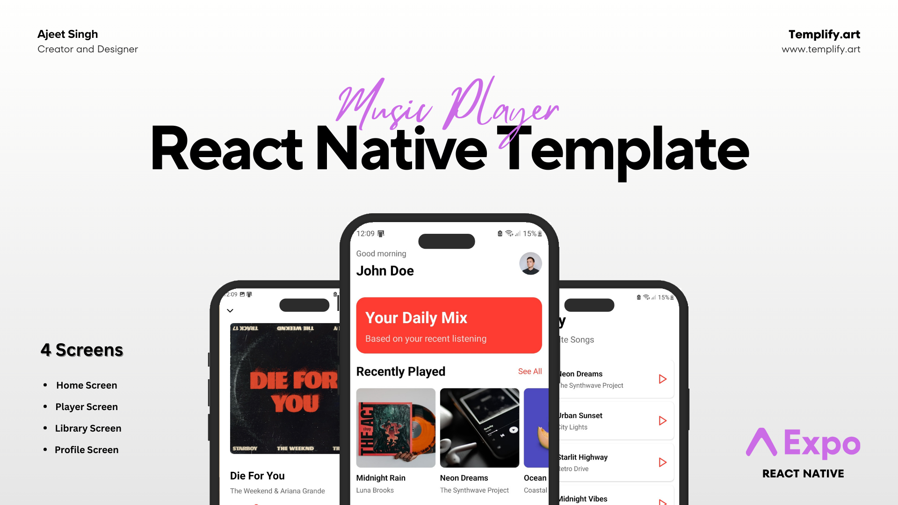

# 🎵 Music Player Template

A **modern and responsive music player UI template** built with **Expo & Bolt**. This template provides a sleek and functional design for music streaming, podcast apps, or any audio-related project.

## 🚀 Features
- 🎨 **Elegant UI** – Minimalist and user-friendly design
- 🎵 **Audio Playback Controls** – Play, pause, skip, and seek songs
- 🖼️ **Album Art Display** – Dynamically loads cover images
- 📂 **Playlist & Favorites** – Easily manage music collections
- 🌙 **Dark & Light Mode** – Adaptive themes for better UX
- ⚡ **Smooth Animations** – Enhances user interactions

## 📦 Tech Stack
- **Framework:** [Expo](https://expo.dev/) (Bolt Expo Starter)
- **Navigation:** React Navigation & Expo Router
- **UI Components:** React Native, Expo Linear Gradient, Expo Vector Icons

## 📂 Installation

1️⃣ **Clone the Repository**
```bash
git clone https://github.com/your-username/music-player-template.git
cd music-player-template
```

2️⃣ **Install Dependencies**
```bash
npm install  # or yarn install
```

3️⃣ **Start the Expo Development Server**
```bash
npm run dev  # or expo start
```

## 📱 Running on Devices
- **Physical Device:** Scan the QR code in **Expo Go**
- **Android Emulator:** `npx expo run:android`
- **iOS Simulator (Mac only):** `npx expo run:ios`

## 📸 Screenshots



## 🌟 Why Use This?
This template saves development time and provides a beautiful foundation for building music-related apps with **React Native & Expo**.

## 📜 License
This project is **open-source** under the [MIT License](LICENSE).

---
🚀 **Start building your music app today!**

command for the android production build
cd android
./gradlew assembleRelease
